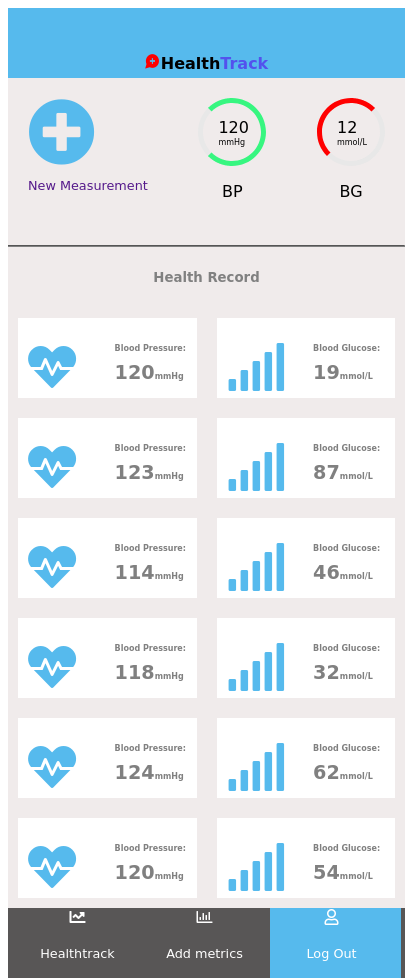

# Health Tracker

This is a simple health tracking application that provide users with the opportunity to measure and record their blood pressure and blood glucose metrics. Measured health paramaters are sent a back end API for storage and also made available retrieval.




## Live Demo
[Deployed app](https://brave-shaw-64c6c4.netlify.app/)

## Built With
- React
- JavaScript
- HTML
- CSS
- Redux

## Getting Started

To run a local copy of this application, follow the steps below:

- Go to the "Code" section of this repository and press the green button that says "Code". Copy the URL or the SSH key.
- Go to the terminal and enter:
```
git clone URL/SSH key
```

The URL or SSH are the links copied from the step above.

- If you don't have git installed, you can download this project and unzip it.
- Change directory into the folder the application is saved.
```
cd directory
```
Directory is the name of your folder.

- Once you have the local copy in your desired folder, go back to your terminal and run:
```
npm install
```
This command installs all the dependencies of the application. Once you complete all installations successfully, you're ready to use the application.

- To start using the application, run:
```
npm start
```
- The application will open up in your browser.

## Usage

Sidn in to the application using just your username. For the sake of this project, no user authentication was implemented.

In the home page, all your previously recorded health parameters are fetched from the beck end and displyed. 

To measure and record new data, navigate to:

```Add metrics button
```

This displays a simple to record your blood pressure and blood glucose data. Once you hit the submit button, these data are sent to the back end for storage.

## Tests

- To run the tests, in the command line interface, type 
```
npm test
```

## Developer

👤 **George Gbenle**

- GitHub: [george-shammar](https://github.com/george-shammar)
- Twitter: [@GeorgeShammar](https://twitter.com/GeorgeShammar)
- LinkedIn: [George Gbenle](https://www.linkedin.com/in/georgegbenle/)

## 🤝 Contributing

Contributions, issues and feature requests are welcome!

## Show your support

Give a ⭐️ if you like this project!

## 📝 License

This project is [MIT](LICENSE) licensed.